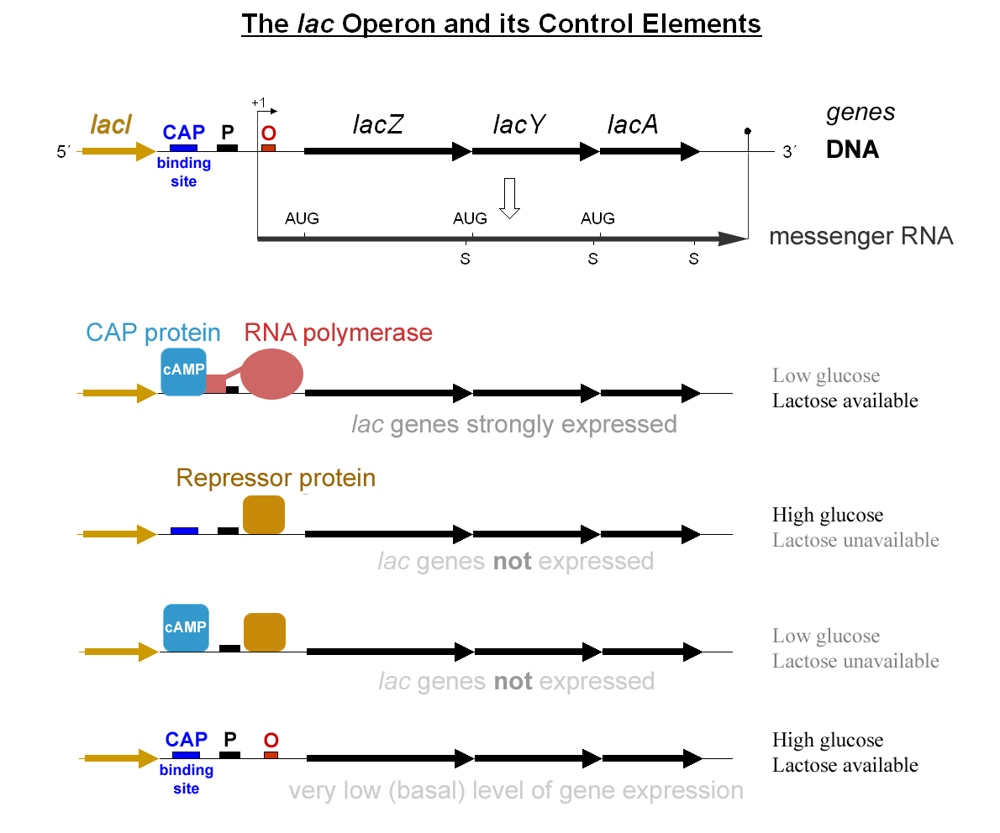
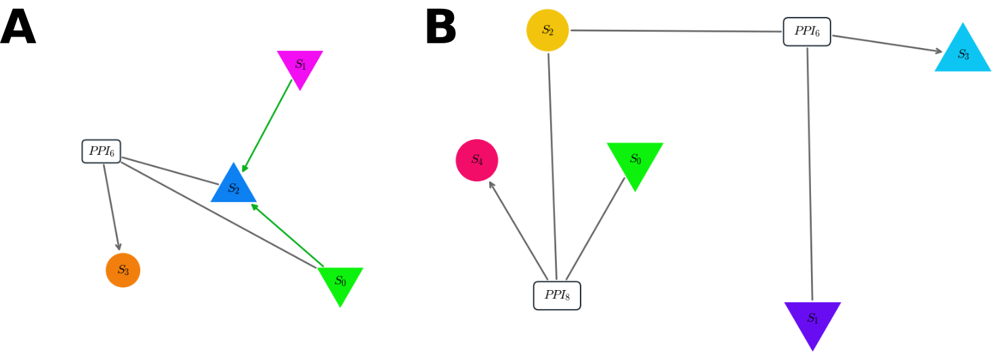

====================================
A simple example: the lactose operon
====================================

Description of the biological problem
=====================================

The lactose operon is one of the most studied example in the regulation
of proteins production. In *Escherichia coli*, the operon [1]_ encodes
three different genes named lacZ, lacY and lacA from which the two
firsts are the most importants. LacZ codes for a protein that hydrolizes
lactose to produce glucose and galactose, which are themselves used by
the cell as carbon sources. LacY encodes a permease, a protein which
pumps the lactose into the cell. Both of these proteins need to be
synthesized by the cell to use the lactose as an energy source, but as
this is costly, and less efficient than using the glucose directly, the
cell manages to produce them only in presence of lactose and in absence
of glucose.

.. _fig-lac-operon:

   Scheme presenting the main elements of the lactose operon along the DNA strain (top), and the state of the operon through several external conditions (bottom). Published on `Wikimedia <https://commons.wikimedia.org/wiki/File:Lac_operon-2010-21-01.png>`__ by G3pro and Tereseik.

Cells have thus designed a logical gate, schematically shown in :num:`Figure #fig-lac-operon` ,
to compute the binary function: *lactose and
no glucose* that controls the expression of the whole operon. The
biological strategy is the following: near the operon, the gene lacI
encodes a repressor of the operon which is constitutively expressed so
that by default, the operon is turned off. When lactose is present in
the medium, a closed form, the allolactose is also present and will bind
to the lacI repressor, thus impeding it to block the operon. It is now
possible to expressed the operon but there is still no activation. The
activator, the CAP protein, is indeed in an active form only in the
presence of cAMP which is produced in absence of glucose [2]_. As long
as glucose is present, the operon is still silent and it is only when
glucose become rare that cAMP goes high, thus activating the CAP protein
which activate the operon and thus the production of the needed
proteins.

Hereafter, we will run our genetic algorithm to optimize a function
close from the logical gate corresponding to the lac operon, that is:
:math:`x,y \mapsto x~\&~\neg~y` (:math:`x~\text{nand}~y`), the link with the biology of the real lac operon would
nonetheless ask more work than will be presented here.

Implementation in the algorithm
===============================

Remark
------

All files, functions and variables names along with terminal commands
will be printed using the LaTeX environment verbatim and display with
``this particular font``.

Two mains questions need to be answered in order to configure the
algorithm for a particular problem. What? and How? : What is the precise
function we need to optimize in order to describe the problem? and How
the solution is allowed to be found by the algorithm? The first will be
mainly described by the C code files like ``init_history.c`` and
``fitness.c`` while the second will be solved through the tuning of the
various parameters in the so called ``init*.py`` file.

The ``init_history.c`` file describes the form of the input(s) that will
be feed into the network. This is done through the construction of the
double array ``isignal[time][n_cell][n_input]`` which indicates the
concentration of the various input with respect to the time and cell.

In our case, we have two inputs that will represent the concentration of
glucose and lactose and will be taken as binary functions (each sugar
has a concentration of :math:`0.0` or :math:`1.0`) which follow a random
sequence of presence and absence, the time being spent in each state
uniformly drawn between :math:`10` and :math:`60` seconds (see
figure [fig:response\_lo]).

The ``fitness.c`` file intend to process the output of the integrator
which is rounded up in the double array named history indexed in the
following way: ``history[Species][Time][Cell]``. The variables
``trackin`` and ``trackout`` keeps in memory the label of the inputs and
outputs species. The fitness is directly printed out by the
``treatment_fitness`` function. (Note however, that
``treatment_fitness`` is a void, fitness is passed with the
``printf("%f",fitness);`` statement.)

For lac operon simulation, each try of the integrator is treated
independantly and follow the time course of the input and output to
determine the times at which production is needed (that is when there is
lactose and no glucose) and the concentration of the output at that
time. We then have chosen to compute the mutual information [3]_ between
:math:`\text{lactose}~\&~\neg \text{glucose}` and the concentration of
the output.

Finally, the ``init*.py`` file indicate the mutation rates of the
different interactions, the number of networks in the population, the
number of generation of the simulation, the initial network from which
we want to start and so on.

In the case of the lac\_operon, we will ask the algorithm to use only
protein-protein interaction (PPI) and repression/activation of gene
(TFHill) and put to zero the parameters indicating the appearance of
other interactions, for example:

::

        random_Interaction('Degradation') = 0
        random_Interaction('Phosphorylation') = 0

which control the rate at which new degradations and phosphorylations
are added to the network to be probed by the evolution.

--------------

Each of this file has to be put in a single folder (in our case
``lac_operon/``) in order to be found by the algorithm. Evolutionary
procedure is now simply launched by running the

::

        python run_evolution.py -m lac_operon

command line while in the main folder. The algorithm will now display a
lot of more or less important stuff in your terminal. The most
interesting are the generation number which indicate at which point of
your simulation you are. When accustomed to it, the ``Best_fitness`` is
an interesting variable to look at to know if the condition you defined
actually allow the algorithm to find valid solution for the problem.
Finally, every line starting by ``ERROR`` needs of course your special
attention.

.. _fig-response-lo:
.. figure:: figures_lac/p2_response.png
   :width: 700px
   :align: center
   :alt: p2_response
   :figclass: align-center

   Detailed response of the network presented in :num:`Figure #fig-network-lo` **A**, colors correspond between the two figures. Orange shades indicate the time at which response is waited.

A word about fitness
--------------------

In order for the evolutionary procedure to give meaningful results, a
special attention need to be given to design a proper fitness function.
There is several reasons for this particular importance but the main one
is that the algorithm will only try to solve the exact problem you have
defined – i.e. minimize the fitness function you have provided – which
is usually different from the actual task you have in mind.

For example, one of the solution proposed by the algorithm for the
lac\_operon fitness proposed earlier (the mutual information between the
output concentration and the
:math:`\text{lactose}~\&~\neg \text{glucose}` function) was to use
lactose as a weak activator of the output and glucose as… a strong
activator of the output! When looking at the time course of the output
concentration, it makes plain sense because the concentration is near
zero when there is no sugar, goes to one when there is only lactose and
saturate around two when there is either glucose only or when both
sugare are presents. Thus if the concentration is around one you know
that you have lactose and no glucose. You can extract the whole
information about the :math:`\text{lactose}~\&~\neg \text{glucose}`
function from the output concentration which is the task we ask for,
even if the answer was quite surprising.

This also mean that you will often want to modify your fitness function
after a first bunch of runs to be more explicit or to try a different
fitness function. To avoid being rapidly lost between your different
simulation, you can look at the ``Seed*/log_fitness.c`` file for a
reminder of the fitness used at this time.

A second remark about fitness is that the function should goes smoothly
from the low fitness landscape to the region you want to explore, that
is the fitness function should already rewards the first steps toward
the solution. Otherwise, the algorithm will be stuck in the low level
region and cannot even start to optimize. This question covers a broad
range of litterature both in evolutionary biology and genetic algorithm
computer science around the fitness-landscape shape question with
suggestive names such as mount Fuji, house of cards or golf-course. It
is usually not a big deal but could bring you some surprise if you don’t
keep it in mind.

How to read and interpret results
=================================

Now that your computer has run several simulations it is time to analyse
them to decipher the output of the evolutionary algorithm. The first
thing to look at is the time course of the fitness for several runs, to
show the fitness of the first run, you can either use the
``Analyse Run`` notebook or use the `Simulation class <analyse.html>`__.

Make sure to check several runs to know the typical fitness of a
successful or failed run, this will discard the cases where the
evolutionary algorithm has been stuck and doesn’t have enough time to
converge.

To study a particular network, you can now type ``network(500)`` if you
want to display the state of the best network in the population at
generation :math:`500` (the end of the simulation given our ``init*.py``
files). It may be small and concise but usually it’s not, evolutionary
procedure tends to accumulate a lot of uninteresting interactions and
species – the famous DNA junk? –that may be ignored. Anyway, this is the
raw result of the evolution.
It will print out the file directory where the network
has been saved for later analysis.

You can from there read and write network (with the read and write
function), compute the fitness (with the ``fitness`` function) and even
look at the time course of the species for a particular realisation of
the fitness computation. If net is your network, just type
``fitness(net, plot=True)``. You can also plot a network using
``net.draw()``.

Finally, you can also add homebrew function to analyse your evolutionary
result by adding a ``analyse.py`` file in the project folder. It will be
imported with ``analyse_network`` through the name ``spec``.

.. _fig-network-lo:

   Pannels **A.** and **B.** shows two typical topologies of the final result of the algorithm trying to optimize our mutual-information fitness. In both pannel, inputs are species :math:`0` (glucose) and :math:`1` (lactose) (down-triangle) and output is the up-triangle.  **A.** Both sugars regulate positively the output, but the glucose also form a dimer with it thus impeding the response. The time course of this network is displayed in :num:`Figure #fig-response-lo`. **B.** Here a single species (S2) can form two complexes, one very strongly with the glucose (S4), and another weaker with the lactose (S3). The former complex being the output.

In our case, out of 10 runs, 80% ended on 2 main different topologies
(after pruning) both performing correctly, that is the fitness plateau
around :math:`-0.8` on a scale of :math:`0` to :math:`-1`. Four
correspond to the network of :num:`Figure #fig-network-lo` -**A** while four
other looks like the one in :num:`Figure #fig-network-lo` - **B**. I let up to
you the biological interpretation of these results [4]_ but the first
obvious feature is the uniformity of the solution. Nearly all the
successfull runs show very similar patern indicating that the biological
grammar available actually imposes strong constraints on the possibles
solution to a particular problem.

Geometry
--------

New interactions
----------------

.. [1]
   In genetics, an operon is a functioning unit of DNA, it designates a
   cluster of genes under the control of a single promoter.

.. [2]
   For curious reader, the reason why, when energy tends to rarify, the
   cell suddenly produces an extraodinary amount of seemingly useless
   proteins is still an active question!

.. [3]
   The mutual information of two random variables is a way to quantify
   the information I can extract about one variable by measuring the
   second.

.. [4]
   Just a hint, for case **B** it seems to me that species 2 should be
   considered as the DNA strain!

.. [5]
   As a particular example, suppose you want to buy a chair. You want it
   comfy, robust and cheap, if you can have more comfort without
   decreasing robustness nor increasin price… that’s better, but between
   the cheap one and the costly but better, it is ultimately a matter of
   taste.
